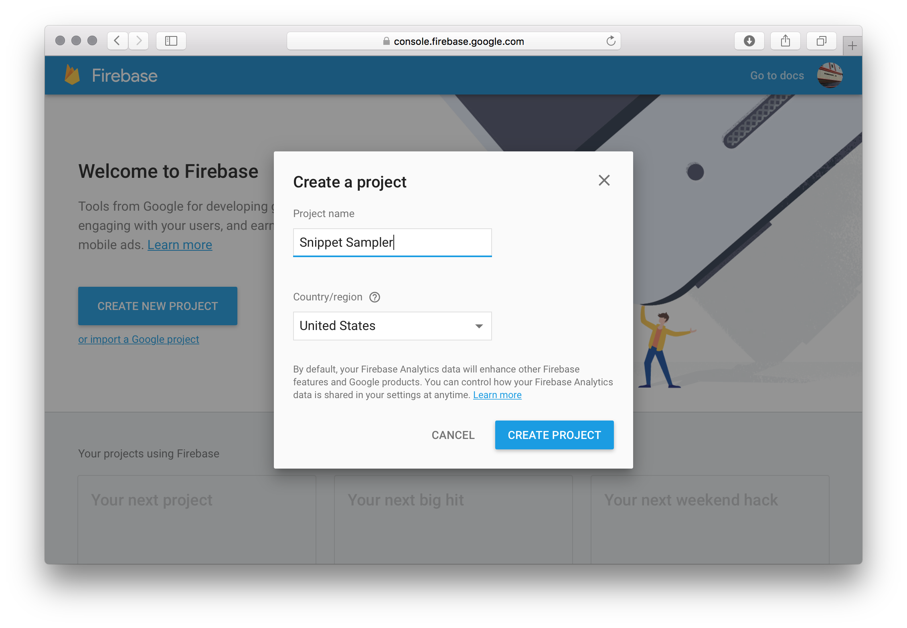
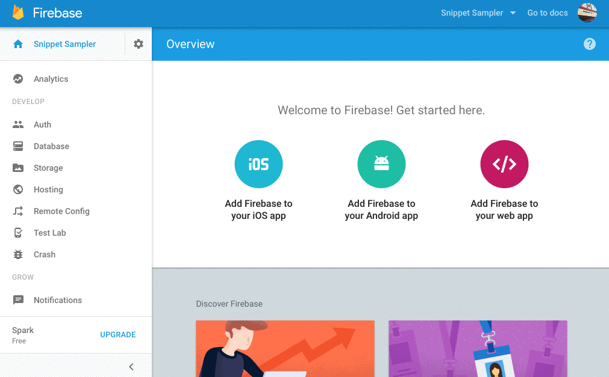
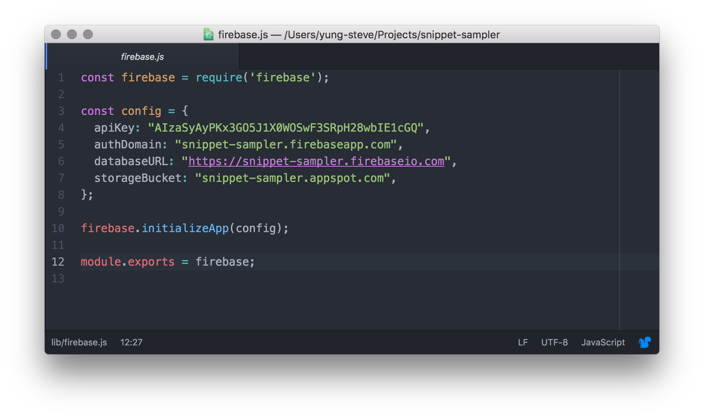
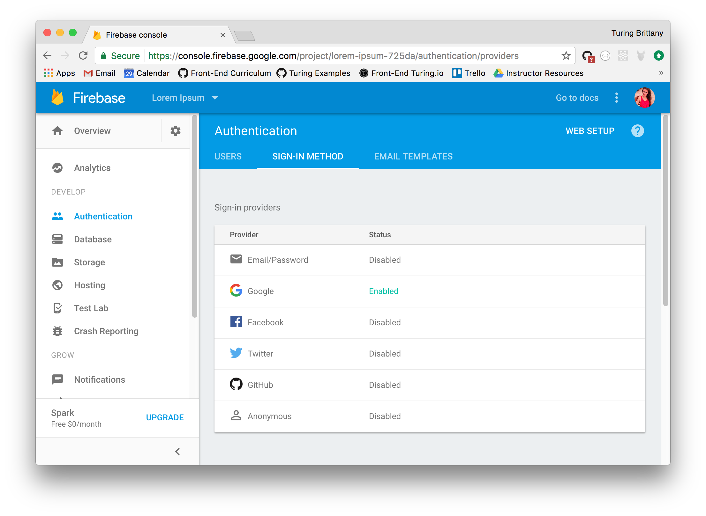

# Snippet Sampler

## Getting Started

First and foremost, let's make a directory.

```
mkdir snippet-sampler
```

Treat yourself to some sweet, sweet `cd` action and head on into that directory.

```
cd snippet-sampler
```

Alright, now let's get a `package.json` in place.

```
npm init --yes
```

We'll probably want some dependencies too.

```
npm install -D firebase firebase-tools jquery webpack webpack-dev-server escape-html
```

Cool. We're not done setting up just yet.

```
touch webpack.config.js
mkdir public lib
touch public/index.html public/style.css lib/index.js
```

We'll use a super simple webpack configuration.

```js
const path = require('path');

module.exports = {
  entry: './lib/index.js',
  output: {
      path: path.join(__dirname, 'public'),
      publicPath: "/public/",
      filename: 'bundle.js'
  },
  devtool: 'cheap-source-map'
};
```

We'll also go ahead and add `start` and `build` scripts to `package.json`.

```js
{
  // Other properties…
  "scripts": {
    "start": "webpack-dev-server",
    "build": "webpack",
    "test": "echo \"Error: no test specified\" && exit 1"
  },
  // Other properties…
}
```

In `public/index.html`, let's add some markup.

```html
<!DOCTYPE html>
<html>
  <head>
    <meta charset="utf-8">
    <title>Snippet Sampler</title>
    <link rel="stylesheet" href="style.css">
  </head>
  <body>

    <header>
      <h1>Snippet Sampler</h1>
      <button id="sign-in">Sign In</button>
      <div id="user-info"></div>
    </header>

    <section id="new-snippet">
      <form id="new-snippet--form">
        <input type="text" placeholder="Title" id="new-snippet--title">
        <div contenteditable placeholder="Code" id="new-snippet--code"></div>
        <input type="submit" id="new-snippet--submit" disabled>
      </form>
    </section>

    <section id="snippets"></section>

    <script src="bundle.js"></script>
  </body>
</html>
```

Let's also have give it some style. We'll use some [CSS variables][], for fun.

[CSS variables]: https://developer.mozilla.org/en-US/docs/Web/CSS/Using_CSS_variables

```css
:root {
  --dark-gray: #333745;
  --hot-pink: #E63462;
  --orange: #FE5F55;
  --light-green: #C7EFCF;
  --pale-green: #EEF5DB;
}

*, html, body {
  box-sizing: border-box;
}

body {
  font: menu;
  color: var(--dark-gray);
}

header {
  text-align: center;
}

#sign-in {
  display: block;
  margin: 1em auto;
  width: 200px;
  padding: 10px;
  border: 4px solid var(--hot-pink);
  background-color: var(--hot-pink);
}

#sign-in:hover {
  background-color: var(--orange);
}

#sign-in:active {
  border-color: var(--light-green);
}

#sign-in:focus {
  outline: none;
}

#new-snippet--title, #new-snippet--code, #new-snippet--submit {
  border: none;
  background-color: var(--pale-green);
  display: block;
  width: 100vw;
  margin-bottom: 1em;
  font-size: 1.4em;
  padding: 1em;
}

#new-snippet--code {
  font-family: monospace;
}

#new-snippet--submit {
  background-color: var(--light-green);
  border: 2px solid var(--orange);
  transition: border 0.5s;
}

#new-snippet--submit:disabled {
  border-color: var(--pale-green);
}

#snippets {
  display: flex;
  flex-wrap: wrap;
  justify-content: space-around;
}

.snippet {
  width: 300px;
  padding: 1em;
  margin-bottom: 2em;
  border: 1px solid var(--hot-pink);
}

pre {
  width: 100%;
  height: 200px;
  overflow: scroll;
  background-color: var(--pale-green);
  border: 1px solid var(--light-green);
}
```

## Configuring Firebase

Head over to https://console.firebase.google.com/ to create a new application.

Hit the big blue button that says "Create New Project."



Next, we'll need to get our hands on those sweet, sweet Firebase keys.

Go to your app, click on "Auth" in the sidebar and then click on "WEB SETUP" in the upper right-hand corner.



Create a new file called `lib/firebase.js`, we'll add the following in order to get Firebase configured and setup.

```js
const firebase = require('firebase');

// Paste the configuration you copied from the Firebase Console above here.

module.exports = firebase;
```



At this point, we have most of our setup done and we're ready to start building our application.

## Wiring Up the User interface

### Caching Selectors

Create a new file called `lib/elements.js` and add the following content.

```js
const $ = require('jquery');

const $snippetsSection = $('#snippets');
const $newSnippetForm = $('#new-snippet--form');
const $newSnippetTitle = $('#new-snippet--title');
const $newSnippetCode = $('#new-snippet--code');
const $newSnippetSubmit = $('#new-snippet--submit');
const $signInButton = $('#sign-in');

module.exports = {
  $snippetsSection,
  $newSnippetForm,
  $newSnippetTitle,
  $newSnippetCode,
  $newSnippetSubmit,
  $signInButton,
  $userInfo
};
```

The last bit of that code is the same as doing the following:

```js
module.exports = {
  $snippetsSection: $snippetsSection,
  $newSnippetForm: $newSnippetForm,
  $newSnippetTitle: $newSnippetTitle,
  $newSnippetCode: $newSnippetCode,
  $newSnippetSubmit: $newSnippetSubmit,
  $signInButton: $signInButton,
  $userInfo: $userInfo
};
```

For example, if you did:

```js
const a = 1;
const object = { a };
```

You'd end up with `object` being `{ a: 1 }`. It's just a shorthand.

### Validating the Form

Create a new file called `lib/validate-input-fields.js` and add the following content:

```js
const {
  $newSnippetTitle,
  $newSnippetCode,
  $newSnippetSubmit
} = require('./elements');

module.exports = () => {
  const bothFieldsHaveContent = $newSnippetTitle.val() && $newSnippetCode.text();
  $newSnippetSubmit.attr('disabled', !bothFieldsHaveContent);
};
```

That first bit is the inverse of what we just talked about. It's the same as doing.

```js
const elements = = require('./elements');
const $newSnippetTitle = elements.$newSnippetTitle;
const $newSnippetCode = elements.$newSnippetCode;
const $newSnippetSubmit = elements.$newSnippetSubmit;
```

Again, it's a shorthand.

### Rendering Snippets

Make a new file called `lib/render-snippet.js` and add the following function in order to render a code snippet as HTML.

```js
const $ = require('jquery');
const escape = require('escape-html');

module.exports = (title, code) => {
  const $snippetElement = $(`
    <article class="snippet">
      <h2 class="snippet--title">${escape(title)}</h2>
      <pre><code class="snippet--code">${escape(code)}</code></pre>
      <button>Remove</button>
    </article>
  `);

  return $snippetElement;
};
```

### A First Pass and Submitting the Form

In `lib/index.js`, we'll pull in the selectors and functions from the modules we just created:

```js
const firebase = require('./firebase');
const validateInputFields = require('./validate-input-fields');
const renderSnippet = require('./render-snippet');
const {
  $snippetsSection,
  $newSnippetForm,
  $newSnippetTitle,
  $newSnippetCode,
  $newSnippetSubmit,
  $signInButton,
  $userInfo
} = require('./elements');
```

Next we'll get check to see if the submit button should be activated in the event that both fields have content.

```js
$newSnippetTitle.on('keyup', validateInputFields);
$newSnippetCode.on('keyup', validateInputFields);
```

Finally, we'll add the event listener, which will add it to the page.

```js
$newSnippetForm.on('submit', (e) => {
  e.preventDefault();

  const title = $newSnippetTitle.val();
  const code = $newSnippetCode.text();

  $snippetsSection.append(renderSnippet(title, code));

  $newSnippetTitle.val('');
  $newSnippetCode.val('');
});
```

At this point, we should have a basic UI that works—albeit, without Firebase installed.

## Setting Up Authentication in Firebase

We'll start by setting up Google authentication.

Go into your Firebase console, head over to the "Auth" menu in the sidebar and turn on Google authentication.



In `lib/index.js`, we'll add the following:

```js
let currentUser;
const provider = new firebase.auth.GoogleAuthProvider();
```

I put the above after my `require` statements. Now, that we're authenticating the user. We don't want to show the form if the user is not authenticated.

```css
#new-snippet--form {
  display: none;
}
```

Let's instead add a sign-in button to display. In `index.html`, add the following to your header:

```html
  <header>
    <h1>Snippet Sampler</h1>
    <button id="sign-in">Sign In</button>
    <div id="user-info"></div>
  </header>
```

Let's also add these new elements to `lib/elements.js`:

```javascript
const $signInButton = $('#sign-in');
const $userInfo = $('#user-info');
```

Don't forget to export them in your `module.exports` as well!

```javascript
module.exports = {
  $snippetsSection,
  $newSnippetForm,
  $newSnippetTitle,
  $newSnippetCode,
  $newSnippetSubmit,
  $signInButton,
  $userInfo
};
```

Next we need to wire up our `$signInButton` element to actually authenticate the user. If we go back to `index.js`, we can create an event handler that will call our firebase authentication method like so:

```javascript
$signInButton.on('click', () => {
  firebase.auth().signInWithPopup(provider);
});
```

You'll now notice that Firebase opens a new pop-up window with your google account listed as an option for sign-in. While this technically completes the authentication process, we'd like to indicate the logged-in status to our users. We'll use our newly created `$userInfo` element to display a 'Signed in as...' message when a user is authenticated. 

Below our click handler for the sign-in button, in `index.js`, we can listen for our Firebase authentication with `firebase.auth().onAuthStateChanged()`:

```javascript
firebase.auth().onAuthStateChanged((user) => {
  currentUser = user;
  $signInButton.toggle(!currentUser);
  $newSnippetForm.toggle(!!currentUser);

  if (currentUser) {
    const { displayName, email } = currentUser;
    $userInfo.text(`Sign in as ${displayName} (${email}).`);
  } else {
    $userInfo.text('');
  }
});
```

This block of code is responsible for several changes in our UI: 

* Toggling the display of the sign-in button and the snippet formed based on whether or not a `currentUser` exists.
* Displaying authentication text in our `$userInfo` element if there is a `currentUser`


